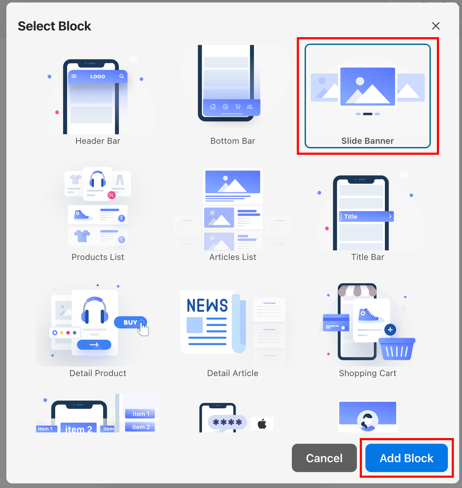
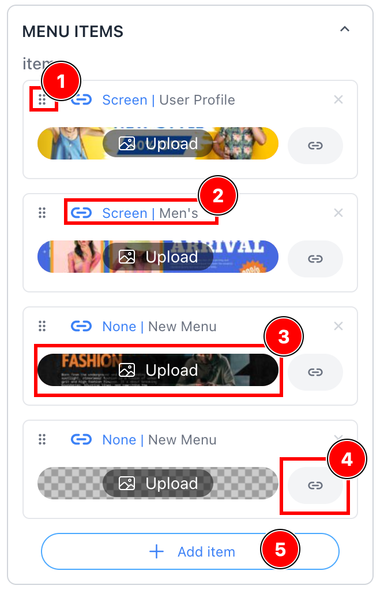
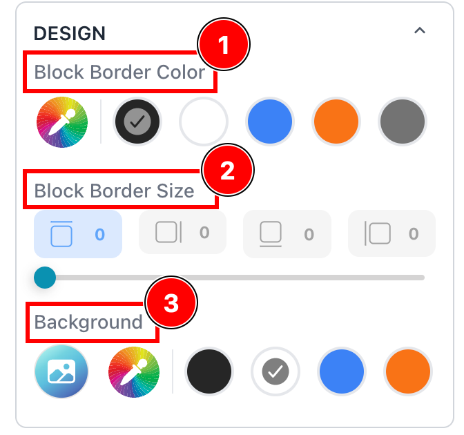
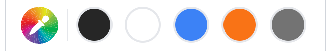
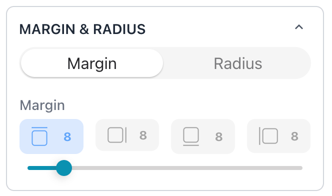
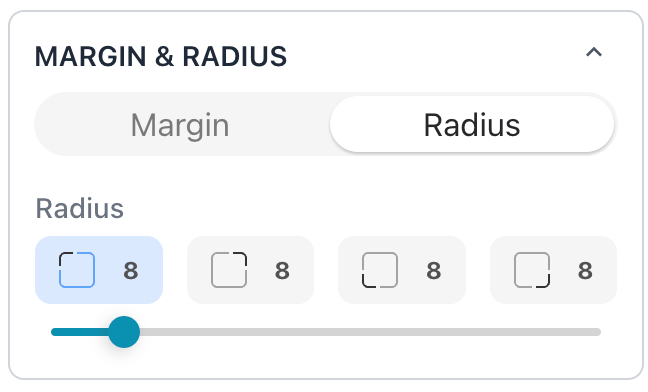
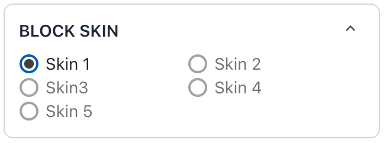
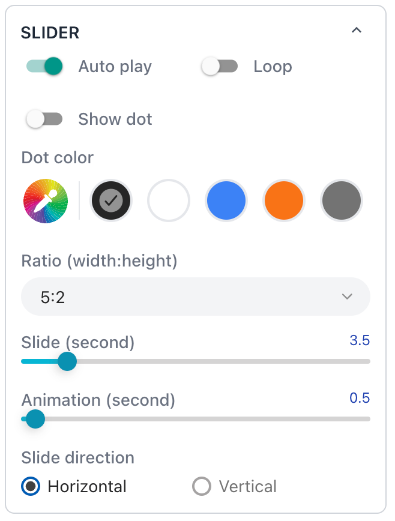
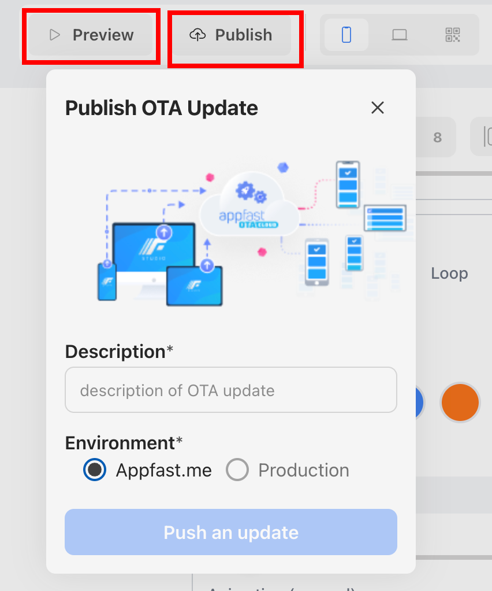

The Article List block is a powerful feature that allows you to dynamically display a list of articles on your page.
This guide will walk you through the steps to create and customize an Article List block using the common block
properties available in Appfast.

## Understanding the Article List Block

The Article List block is designed to automatically generate a list of articles based on the content available in your
website. This block is particularly useful for displaying blog posts, news updates, or any other type of article-based
content.

## Adding an Article List Block

### Step 1: Navigate to the Block Section

To add a Slide Banner block, navigate to the section of your page where you want the banner to appear. Click on the Add
Block button, and from the available block options, select Slide Banner.

### Step 2: Configuring the Article List

Once the block is added, you can start configuring the slides:

- Add New Slide: Click on **Add item** (5) to include a new slide in the banner.
- Content:
    - Each slide can include an image, text, or a combination of both. You can upload images or use existing ones from
      your media library (3).
    - Each slide can be linked (4) to a screen, an URL, a project, or even perform an action in the app. You can also
      set it to No-Link to not link to anywhere (2).
- Slide Order: Arrange the slides in the desired order by dragging and dropping them within the block settings (1).

## Customizing the Block Properties

The Slide Banner block comes with several customizable properties that allow you to tailor its appearance to match your
design needs. Here’s a quick overview of the common block properties:

### Common Block Properties:

- Border (1) (2): Add borders to the block for additional styling. This can help the banner stand out or blend in with
  the rest of the page design.
- Background Color (3): Set a background color for the block to enhance the visual appeal or match your brand colors.

> 
>
> Note that if no color is ticked, it means the transparent color is selected.
>
> This color list is displayed based on your most usage.

|  |  |
|-------------------------------------------------------------------------|-------------------------------------------------------------------------|

- Margin: Adjust the spacing outside (margin) the block to fit your layout. These properties help ensure that the block
  aligns well with other elements on your page.
- Radius: Set the corner radius for the block to enhance its visual appeal on your page.

### Article List-Specific Properties:

- Skin: Choose how Slide Banner appears on your page by selecting different types of the slide.

- Auto play: Set the time interval for automatic slide transitions. You can also enable or disable auto-slide based on
  your preference.
- Loop: Enable or disable loop transition of the slide.
- Show dot: Enable or disable navigation dots to allow users to know which slide is displayed currently.
- Dot color: Set the color of the dots.
- Slide and Animation (second): Set the time for slide transitions.
- Slide direction: Set the direction for the Slide Banner.

## Preview and Publish

Once you’ve configured the Slide Banner block to your liking:

- Preview: Use the preview function to see how the banner will look on different devices (desktop, tablet, mobile).
- Publish: When satisfied with the design, click Publish to push OTA update to make the Slide Banner live on your app.

### Best Practices for Using Article List

- **Limit the Number of Slides:** While it might be tempting to include many slides, keeping the number of slides to a
  minimum ensures that users focus on the key messages.
- **Use High-Quality Images:** Ensure that the images used in your slides are of high quality and optimized for fast
  loading times.
- **Clear Call-to-Actions:** Each slide should have a clear call-to-action (CTA) to guide users on what to do next,
  whether it’s clicking a link, signing up for a newsletter, or exploring more content.

By following these steps, you can create a compelling and effective Slide Banner block that enhances the visual appeal
of your website while delivering key messages to your audience.
